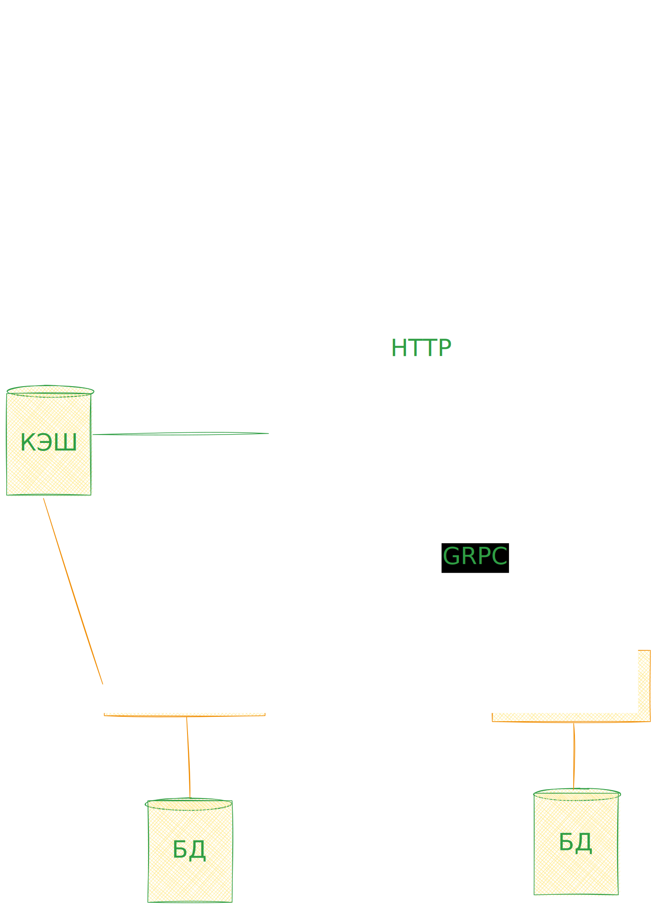

<!-- prettier-ignore-start -->
# mvp-chehoch

Перед началом работы запустите `initialisation.bat`

```cmd
.\initialisation.bat
```

или, если есть NodeJS

```cmd
npm run init:project
```


## group project at the university



<!-- prettier-ignore-end -->
